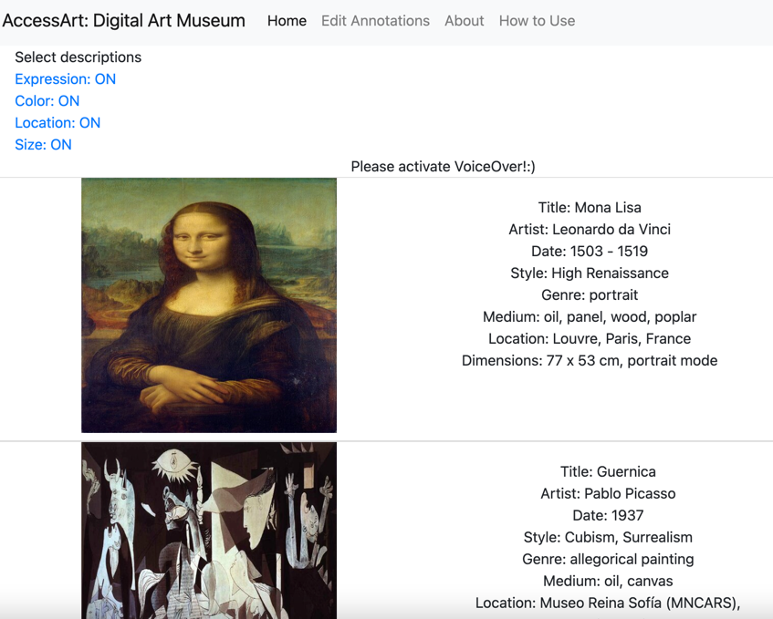

# Hearing Masterpiece (AccessArt): Accessible Art Gallery for People with Visual Impairments

## Demo

[AccessArt v.1 Website](https://m-hearing-masterpiece.web.app/index_home.html) (Activate VoiceOver for appreciation)

[Video](https://www.youtube.com/watch?v=JpwQvlvhqLs)


## Related Publication
[c.3] Supporting Object-level Exploration of Artworks by Touch for People with Visual Impairments (ASSETS 2019)

[c.2] Supporting a Crowd-powered Accessible Online Art Gallery for People with Visual Impairments: A Feasibility Study (UAIS 2021) 

[c.1] Touch Screen Exploration of Visual Artwork for Blind People (Web Conference 2021)

## Compatibility


Setting the virtual env with requirements
```
python3 -m venv env 

source env/bin/activate 

pip install -r requirements.txt
```

## Deployment
This project can be easily deployed using firebase. 
Keep the html files and resources in the 'public' directory and follow the instruction in [Firebase](https://firebase.google.com/?gclid=CjwKCAjw5c6LBhBdEiwAP9ejG0Pg0Xe9mUSbWq5i8ofCSetqNvMXN4_UJZjVbtpeoPGZFgrn3yocIRoCQM8QAvD_BwE&gclsrc=aw.ds) to deploy.

### Main Page for Image Selection
`[main url]/index_home.html (AccessArt v.1 [c.2]: object & part mode exploration)
`

`[main url]/index_home_2.0.html (AccessArt v.2 [c.3]: hierarchical exploration)
`

Example for AccessArt v.1: [AccessArt v.1 Website](https://m-hearing-masterpiece.web.app/index_home.html) (Activate VoiceOver for appreciation)


### Url Parameters for Image Exploration

Example
`[main url]/index.html?img_id=1&lan=e&color=1&loc=1&exp=1&size=1
`
#### image id and language
```
img_id: image id (example: img_id.png)

lan: language (e: english, k: korean)
```

#### description included (1: include, 0: not include) [c.2]
```
color: color of object

loc: location

exp: expression

size: size of object
```

## Main Javascript Files for Reference

Check javascript files under /public/js/ for main functions.

### AccessArt v.1 [c.2]
Support object and part mode
- load_image.js: load the image and json file for annotation
- polygon.js: draw polygons on the image

### AccessArt v.2 [c.3]
Support hierarchical exploration
- load_image_2.0.js
- polygon_2.0.js


## Usage
This code supports VoiceOver in Apple mobile devices. 

----
Contact me for questions: [Nahyun Kwon](https://nahyunkwon.github.io)

© [HCIL](https://hcil-ewha.github.io/homepage/) @ Ewha Womans University
